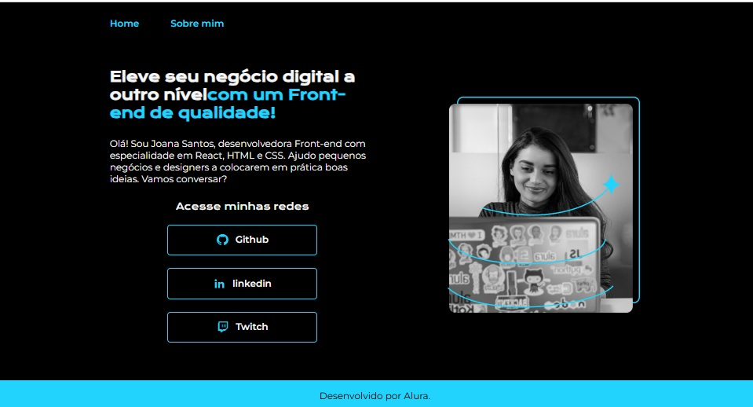
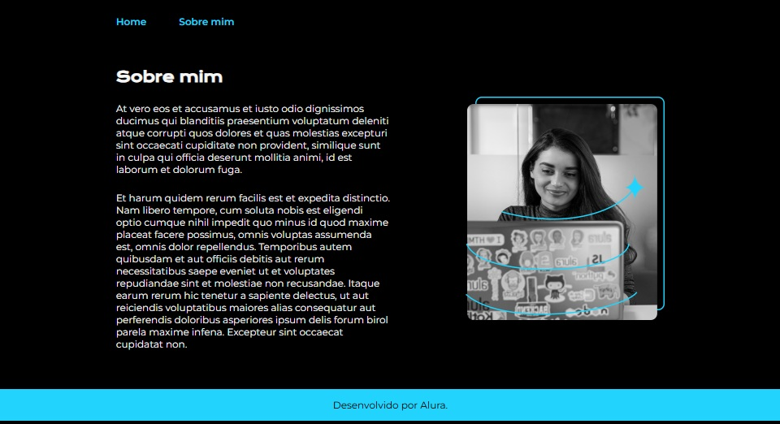

# Índice 

* [Apresentação](#Apresentação)
* [Descrição do Projeto](#Descrição)
* [Status do Projeto](#Status)
* [Página Home](#PaginaHome)
* [Página Sobre mim](#PaginaSobreMim)
* [Tecnologias utilizadas](#Tecnologias)
* [Licença](#Licença)
* [Conclusão](#Conclusão)

# Apresentação

# Descrição

Projeto criado em Fev/2025, como fruto de aprendizado em programação HTML e CSS disponibilizado pelo Projeto ONE (Oracle + Alura).

Esta ferramenta demonstra métodos de configuração de um portal estático, contendo 2 páginas (Home e Sobre mim), com configurações de responsividade, utilizando limite de 1200px

O objetivo desta página consiste no aprendizado (e exemplo) de como criar um Site/Portal responsivo.

# Status

Este projeto encontra-se CONCLUÍDO, baseando-se nas orientações fornecidas através dos vídeos compartilhados no Projeto ONE (https://cursos.alura.com.br/course/html-css-responsividade-publicacao-projetos/task/121402)

Contudo, algumas melhorias podem ser aplicadas.

# PaginaHome

Esta página apresenta um breve resumo/oferta de trabalho.

Apresenta também hiperlinks de acesso a alguns repositórios e portfolio.

# PaginaSobreMim

Esta página apresenta um breve resumo do perfil do autor.

Uma pessoa apaixonado por tecnologia e entusiasta da automação de processos, e que adora desafios.

# Tecnologias

No repositório serão encontrados arquivos correspondentes a HTML e CSS .

# Licença

# Conclusão

Fev/2025
 
