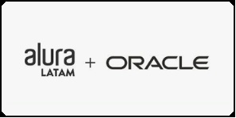

# Índice 

* [Apresentação](#Apresentação)
* [Descrição do Projeto](#Descrição)
* [Status do Projeto](#Status)
* [Funcionalidades e Demonstração da Aplicação](#Funcionalidades)
* [Cadastrando seus Amigos](#Cadastrando)
* [Desenvolvimento](#Desenvolvimento)
* [Tecnologias utilizadas](#Tecnologias)
* [Licença](#Licença)
* [Conclusão](#Conclusão)

# Apresentação

# Descrição

Projeto criado em Fev/2025, como fruto de aprendizado em programação HTML e CSS disponibilizado pelo Projeto ONE (Oracle + Alura).

Esta ferramenta demonstra lógica de configuração de um portal, contendo 2 páginas (Home e Sobre mim), com configurações de responsividade, utilizando limite de 1200px

O objetivo desta página consiste no aprendizado (e exemplo) de como criar um Site/Portal estático e responsivo.

# Status

Este projeto encontra-se CONCLUÍDO, baseando-se nas orientações fornecidas através dos vídeos compartilhados no Projeto ONE (https://cursos.alura.com.br/course/html-css-responsividade-publicacao-projetos/task/121402)

Contudo, algumas melhorias podem ser aplicadas.

# Funcionalidades

Esta ferramenta possui uma única tela (ver acima), onde destacamos:

A: Campo para ser informado/digitado cada um dos nomes das pessoas indicadas.

B: Botão destinado à verificação e inserção do nome informado/digitado, na lista, caso o mesmo não tenha sido informado anteriormente.

C: Botão destinado à realização (de maneira aleatória) do "sorteio" do nome indicado para ser seu AMIGO SECRETO (se pressionado mais de uma vez, poderão ser observados resultados de maneira aleatória).

# Cadastrando

Utilizando o campo "A" indicado na tela anterior, digite/informe um nome e em seguida clique no botão [Adicionar].

O nome será listado logo abaixo do campo "A".

Após clicar no botão [Adicionar] o nome será apresetnado conforme exemplificado na tela abaixo e o campo estará disponível para o próximo nome.

# Desenvolvimento

Ferramenta desenvolvida por Reinaldo Rodrigues (https://github.com/rrodrigues-ftc).

Apaixonado por tecnologia e entusiasta da automação de processos, e que adora desafios.

# Tecnologias

No repositório serão encontrados arquivos correspondentes a HTML, CSS e JavaScript.

# Licença

# Conclusão

Jan/2025
 
